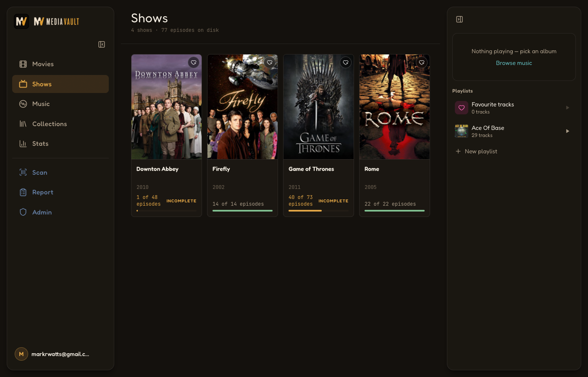
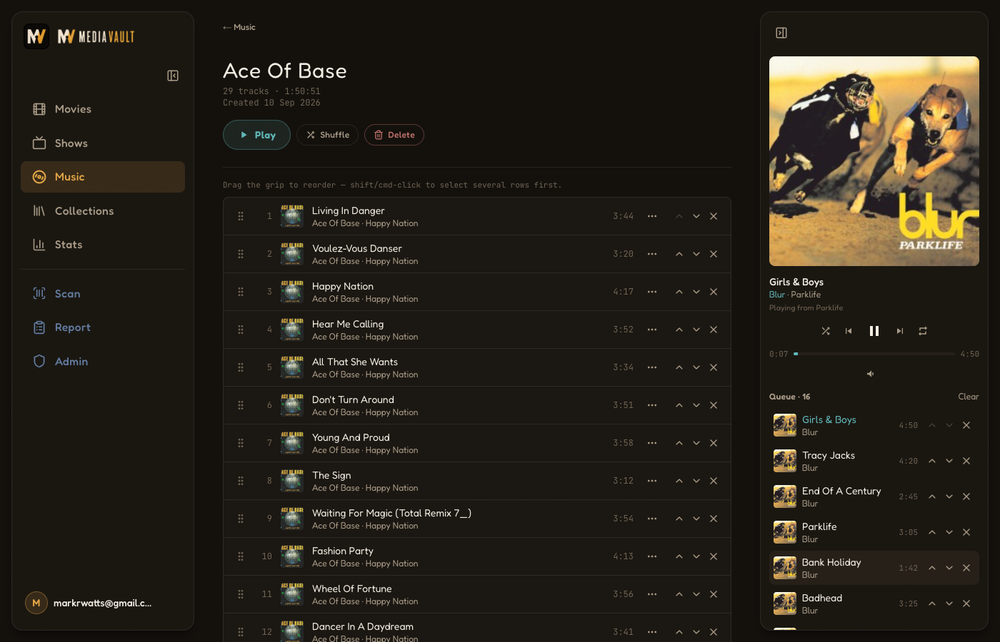

<p align="center">
  
</p>

MediaVault is a household media library for a film, TV and music collection
kept on a NAS share and served by Jellyfin. It scans the share, probes every
file with ffprobe for its real resolution and soundtracks, enriches the
result from TMDB, Discogs and Spotify, and presents a poster-forward library
that the whole household signs into: each member has their own sign-in,
favourites, playlists and watch history, while the catalogue itself is
shared.

It is a collector's tool as much as a player. Films can be marked as owned
on DVD, Blu-ray or Ultra HD Blu-ray independently of whether they have been
ripped; albums track the CD and vinyl pressings on the shelf, each linked to
its own Discogs release; a barcode scanner adds new discs from the camera or
a USB scanner gun; and a report page lists what is missing from every
collection, show and back catalogue.

## What it does

- **Movies** — every owned film, searchable and filterable by video and
  audio codec, with disc-format marks (DVD, Blu-ray, Ultra HD Blu-ray),
  resolution and HDR badges, and BBFC certificates. Films in the same
  collection stack into one card. Shelves for continue watching, favourites,
  new releases and recently added, each collapsible.
- **Film detail** — every version on disk (theatrical vs director's cut,
  DVD vs Blu-ray) with its resolution, codec, size and soundtrack list
  (Dolby, DTS-HD MA, TrueHD, channel layout, language), a Play button, a
  favourite heart and a reset-viewed control.
- **Shows** — TV series with season-by-season episode lists, missing
  episodes greyed out, per-episode Play buttons, a continue-watching row,
  and favourites. Episode numbering follows disc order (TMDB DVD episode
  groups), because this is a disc library.
- **Playback** — films and episodes play in the app through Jellyfin's
  transcoder, brokered by MediaVault so the Jellyfin API key never reaches
  the browser. Two qualities: Original (video copied, audio transcoded only
  where needed) and Remote (720p, about 4 Mbit/s), with Remote the default
  when a viewer arrives from the internet. Resume position, completion and
  play counts are recorded per member.
- **Music** — artists with their Discogs studio back catalogue, owned
  albums shown against the gaps, artist photos from Spotify or Discogs and
  biographies from Discogs or Wikipedia. The index and each artist page are
  grouped by the format you own: Digital & CD, and Vinyl. An album page
  switches between the digital copy and each physical pressing, with the
  pressing's own tracklist, catalogue number and cover art.
- **Music player** — gapless, lossless, app-wide. Every track streams as raw
  PCM at the device's own sample rate and starts on the first half-second
  chunk, so playback begins about 100 ms after the click on the LAN.
  Playback survives navigation. A right-hand rail holds the Now Playing
  card, a cross-album queue (play next, add to queue, reorder) and the
  playlists list; on a phone it is a strip above the tab bar that opens a
  full-screen sheet.
- **Favourites and playlists** — per member: favourite films, shows,
  tracks, albums and artists. Favouriting an album or artist creates a
  linked playlist of its playable tracks, and un-favouriting removes it.
  Playlists can be renamed, reordered by drag with multi-select, and
  played or shuffled from the rail.
- **Collections** — film series in release-order timelines with missing
  films greyed out and a completion bar.
- **Report** (app owner) — missing films per collection, missing episodes
  per show, missing albums per artist, Blu-ray upgrade candidates, films
  that need a metadata look, and a codec breakdown of every disc.
- **Stats** — each member's own watch time, most-watched titles and genres,
  and recent history across films and episodes.
- **Scan** (app owner) — barcode lookup against Discogs, TMDB and a UPC
  database, with a persistent cross-device scan queue for a batch session
  at the shelf.
- **Households** — email one-time-code sign-in with no passwords, optional
  passkeys per device (Face ID, Touch ID, Windows Hello, security keys),
  invite-based membership, an access-code web of trust for new households,
  and an owner-only admin area for access codes, the audit log, scan and
  enrich runs and integrations. Members can also sign into Jellyfin itself
  with their MediaVault account.

## Screenshots

| Movies | Film detail |
| --- | --- |
|  |  |

| Shows | Show detail |
| --- | --- |
|  |  |

| Collections | Collection timeline |
| --- | --- |
|  |  |

| Music | Artist |
| --- | --- |
|  |  |

| Album, playing | Playlist |
| --- | --- |
|  |  |

| Report | Report, expanded |
| --- | --- |
|  |  |

## Stack

Next.js 16 (App Router, React 19) · Prisma 7 + SQLite · Tailwind 4 ·
BetterAuth (email OTP, passkeys, households, OIDC provider) · hls.js ·
Web Audio · ffprobe/ffmpeg · TMDB · Discogs · Spotify · Wikipedia ·
Jellyfin · Resend.

Documentation:

| File | What it covers |
| --- | --- |
| [PLAN.md](PLAN.md) | Architecture, data model, pipelines, playback design, access model, and the current roadmap. |
| [DEPLOYMENT.md](DEPLOYMENT.md) | Docker and VM deployment, the shared Caddy edge, Cloudflare Tunnel exposure, backups, owner-run scripts. |
| [HOUSEHOLDS_PLAN.md](HOUSEHOLDS_PLAN.md) | Design record: accounts, the web of trust, roles, watch history, Jellyfin SSO. |
| [PASSKEYS_PLAN.md](PASSKEYS_PLAN.md) | Design record: passkey sign-in. |
| [PLAYBACK_PLAN.md](PLAYBACK_PLAN.md) | Design record: in-app video playback, and why it moved to Jellyfin. |
| [PLAYLISTS_PLAN.md](PLAYLISTS_PLAN.md) | Design record: the app-wide music engine, right rail, favourites and playlists. |
| [SIDEBAR_PLAN.md](SIDEBAR_PLAN.md) | Design record: the shared left-sidebar shell. |
| [docs/TEST_PLAN_2026-09.md](docs/TEST_PLAN_2026-09.md) | Manual test plan from the September 2026 playback and passkey rollout. |

## Configuration

Everything external is an environment variable. Local dev reads `.env`
(template: [.env.example](.env.example)); the Docker deployment reads
`.env.docker` on the server (template:
[.env.docker.example](.env.docker.example)). The templates carry the full
list with comments; the tables below cover what matters most.

### Media paths

| Variable | Meaning |
| --- | --- |
| `MOVIES_PATH` | Folder of movie files the scanner walks. |
| `TVSHOWS_PATH` | Folder of TV shows (`Show (Year)/Season NN/Show SxxEyy.ext`). Optional; unset skips every TV feature. |
| `MUSIC_PATH` | Folder of a music library in iTunes layout (`Artist/Album/NN Track.m4a`). Optional; unset skips every music feature. |
| `POSTER_CACHE_DIR` | Where downloaded artwork is cached (posters, backdrops, covers, artist photos). |
| `DATABASE_URL` | SQLite location, e.g. `file:./data/mediavault.db`. |
| `FFPROBE_DOCKER_IMAGE` | Dev-only fallback: run ffprobe and ffmpeg through `docker run` when they are not on PATH. The deploy image installs ffmpeg. |

### Authentication (required)

Every route requires a signed-in household member. Sign-in is an emailed
one-time code, so email sending is a prerequisite. Passkeys are an optional
extra per device and need HTTPS or `localhost`.

| Variable | Meaning |
| --- | --- |
| `BETTER_AUTH_SECRET` | Session and cookie signing key. Generate with `npx @better-auth/cli secret`. |
| `BETTER_AUTH_URL` | The app's own public base URL. Must be a real HTTPS URL in production; it also sets the passkey origin and the OIDC issuer. |
| `RESEND_API_KEY` | [Resend](https://resend.com) API key for the sign-in code emails. |
| `ALLOWED_EMAILS` | Comma-separated addresses that can always sign in: the app owner's. Everyone else gets in through household membership, a pending invitation or a minted access code. |

### Metadata sources

| Variable | Meaning |
| --- | --- |
| `TMDB_API_KEY` | Free key from themoviedb.org. Optional; without it films and shows are scan-only (no posters, collections, certificates or missing-content detection). |
| `DISCOGS_TOKEN` | Personal access token. Optional; unauthenticated lookups work, but a token raises the rate limit from 25 to 60 calls a minute, worth having before a full Enrich Music pass. |
| `SPOTIFY_CLIENT_ID` / `SPOTIFY_CLIENT_SECRET` | A free Spotify developer app. Optional; when set, Spotify is the primary artist-photo source, with Discogs as the fallback. |
| `AUDIODB_API_KEY` / `FANART_API_KEY` | Currently unused. Those sources were keyed by a MusicBrainz id the app no longer has since the Discogs cutover. Left in place for a future revisit. |

### Jellyfin

| Variable | Meaning |
| --- | --- |
| `JELLYFIN_URL` | Jellyfin base URL, e.g. `http://<nas>:8096`. |
| `JELLYFIN_API_KEY` | Token from Dashboard → API Keys. Unset disables in-app video playback and the sync. |
| `JELLYFIN_MOVIES_PREFIX` / `JELLYFIN_TV_PREFIX` | Path prefixes Jellyfin's items carry before the relative file path (defaults `/media/Movies/` and `/media/TV Shows/`). |
| `JELLYFIN_MAX_SESSIONS` | How many members may stream through Jellyfin at once. Default 2; each is a transcode on the Jellyfin host. |

A sync job matches Jellyfin items to files by path (Unicode-normalised, so
macOS-scanned paths match Linux ones), runs after every scan, and is what
makes a version or episode playable in the app.

**Jellyfin SSO** lets members sign into Jellyfin with their MediaVault
account through [jellyfin-plugin-sso](https://github.com/9p4/jellyfin-plugin-sso).
It needs no extra variables. From `/admin` → Integrations, paste Jellyfin's
SSO redirect URI and you get a client id and secret, shown once; in the
plugin, set the OIDC endpoint to `{BETTER_AUTH_URL}/api/auth`. Discovery
only works over a real public HTTPS URL.

## Development

```bash
cp .env.example .env            # fill in paths, keys and ALLOWED_EMAILS
npm ci --legacy-peer-deps
npx prisma migrate dev
npx prisma generate
npm run dev                      # http://localhost:3000
```

Sign in with an address listed in `ALLOWED_EMAILS`, then grant yourself the
app-owner role so Scan, Report and Admin appear:

```bash
npx tsx scripts/grant-app-owner.ts you@example.com
```

Scans and enrichment run from Admin, or by POSTing to the owner-only API
routes with the browser's session cookie:

```bash
curl -X POST localhost:3000/api/scan/film     # add ?force=1 to re-probe everything
curl -X POST localhost:3000/api/scan/tv
curl -X POST localhost:3000/api/scan/music
curl -X POST localhost:3000/api/enrich/film
curl -X POST localhost:3000/api/enrich/tv
curl -X POST localhost:3000/api/enrich-music
curl -X POST localhost:3000/api/jellyfin-sync
```

### Owner-run scripts

All run with `npx tsx scripts/<name>.ts` against whatever `DATABASE_URL`
points at. On the server, run them inside the container (see
[DEPLOYMENT.md](DEPLOYMENT.md)).

| Script | Purpose |
| --- | --- |
| `gen-access-code.ts` | Mint an access code for a new household. |
| `grant-app-owner.ts` | Give an existing user the app-owner role. |
| `backfill-certifications.ts` | Fetch BBFC certificates for films and shows enriched before certificates existed. |
| `reprobe-audio-tracks.ts` | Refresh audio-track dispositions so the main soundtrack, not an audio-description track, is picked. |
| `attach-cd-discogs-releases.ts`, `backfill-album-discogs-url.ts`, `backfill-digital-cover-from-cd.ts` | One-off music backfills from the Discogs cutover. |
| `export-discogs-snapshot.ts`, `apply-discogs-snapshot.ts` | Copy a verified set of Discogs matches from one database to another. |

## Tests

```bash
npm run lint && npm run typecheck && npm test
```

CI runs the same three plus `npm audit` on production dependencies. The
unit suite covers the filename parsers against a lived-in library's quirks,
the access model (web of trust, access codes, route guards, session
cookies), the player engine against a fake audio context, playlist
mutations, the Jellyfin playback broker, and the parked ffmpeg pipeline,
including a real-ffmpeg HLS integration test.

Two browser-driven harnesses cover what unit tests cannot. Both start their
own throwaway `next dev` on a scratch database and touch nothing real. Point
them at Google Chrome; Playwright's own Chromium lacks the codecs and its
download is unreliable here.

```bash
E2E_CHROMIUM="/Applications/Google Chrome.app/Contents/MacOS/Google Chrome" \
  npx tsx scripts/e2e-passkey.ts      # WebAuthn ceremonies via a virtual authenticator, ~1 min
E2E_CHROMIUM="/Applications/Google Chrome.app/Contents/MacOS/Google Chrome" \
  npx tsx scripts/e2e-playback.ts     # the parked local HLS pipeline, ~3 min, needs ffmpeg on PATH
```

`E2E_PORT` picks the throwaway server's port (3007 and 3008 by default).
