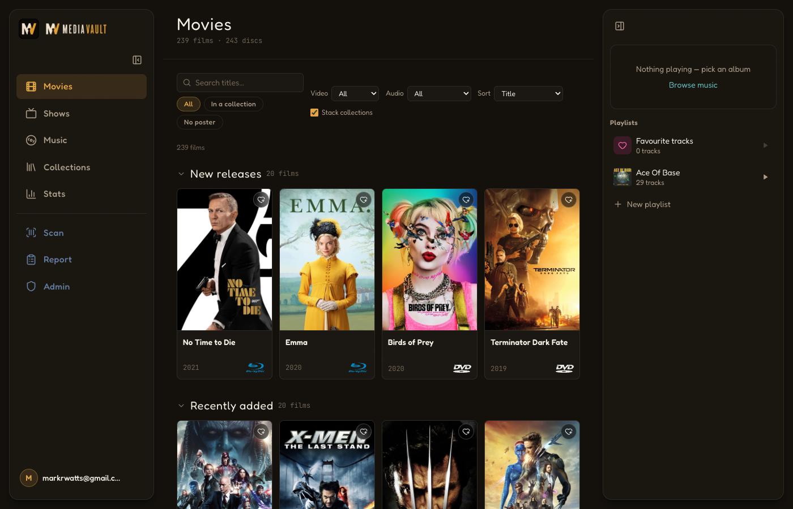
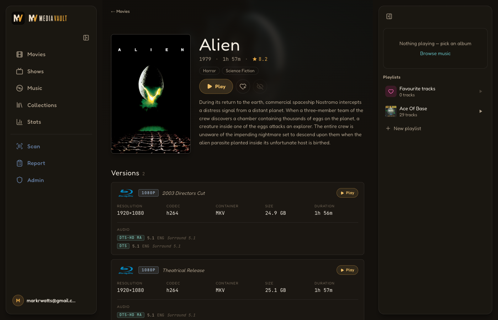
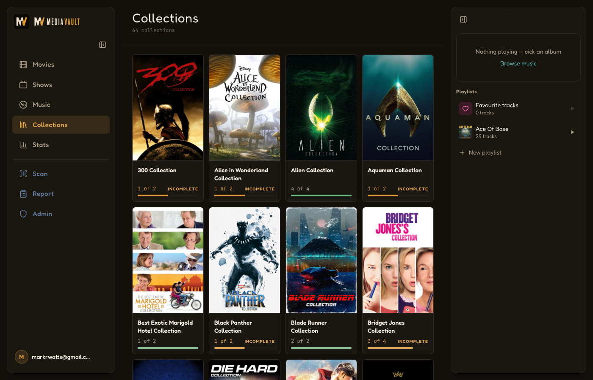
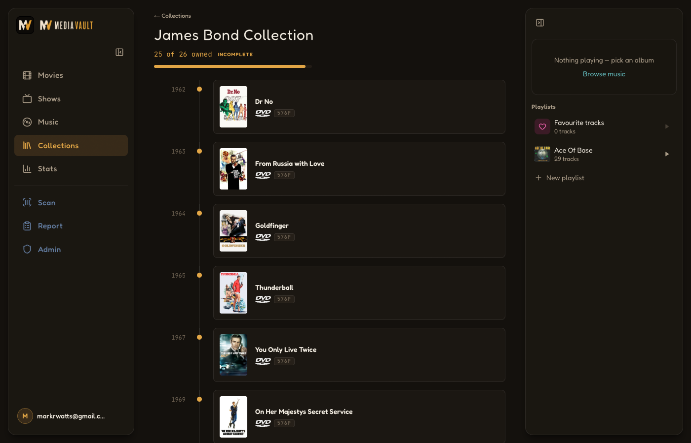
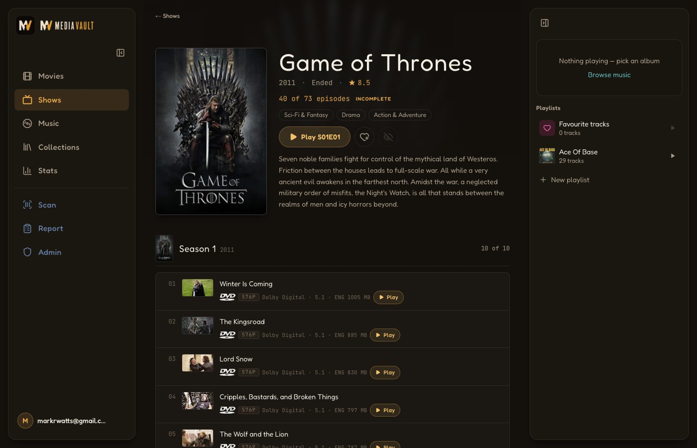
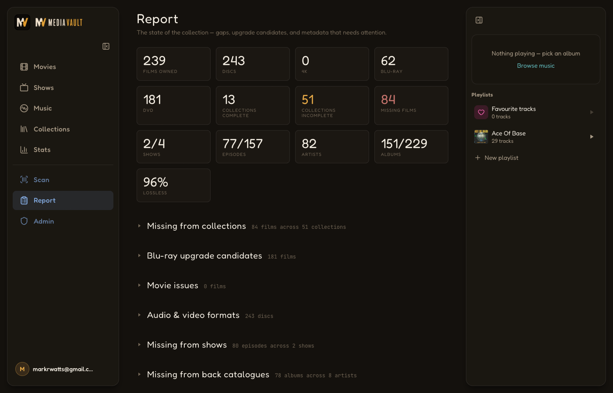
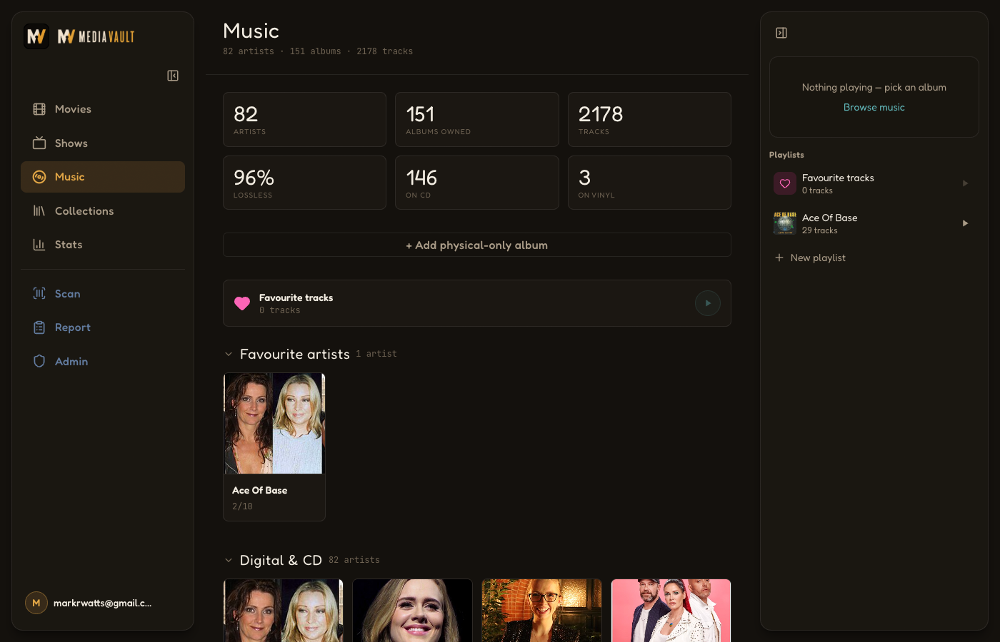
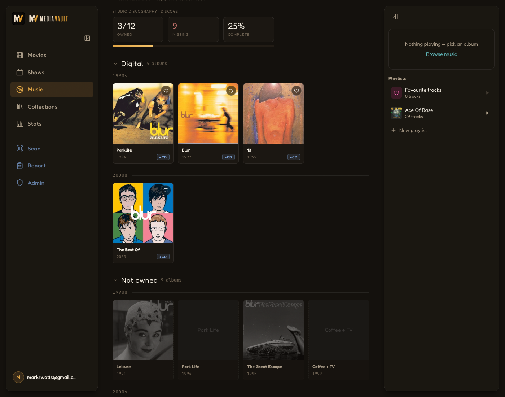
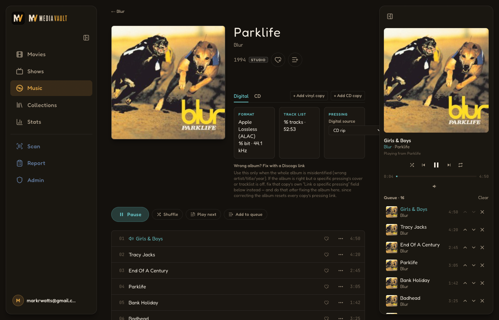
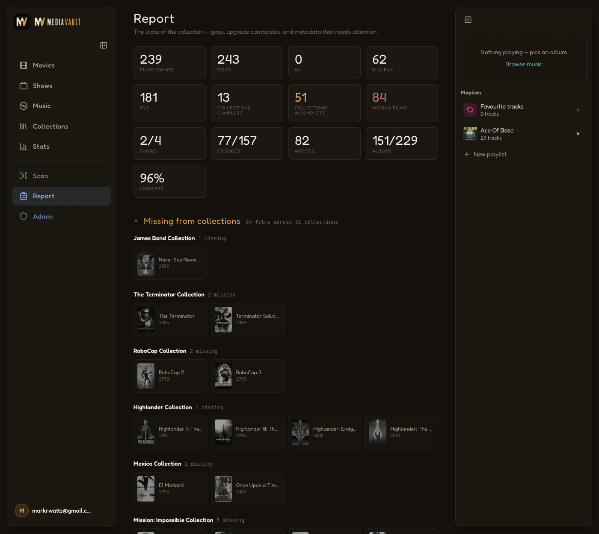

<p align="center">
  
</p>

A personal index of a DVD/Blu-ray film and TV collection stored on a NAS SMB
share (also served by Jellyfin). It scans the share, probes every file with
ffprobe for real resolution and soundtracks, enriches from TMDB, and presents
a poster-forward library with collection timelines, season-by-season show
pages, and a "what's missing" collector's report.

- **Library** — every owned film, searchable/filterable, with format
  (4K/Blu-ray/DVD) and resolution badges.
- **Film detail** — editions (theatrical vs director's cut), resolutions,
  soundtracks (Dolby/DTS profile badges, HDR labels), file details, and
  per-version "Play in Jellyfin" links.
- **Shows** — TV series with per-season episode lists, missing episodes
  greyed out, and per-episode play links. Episode numbering follows disc
  order (TMDB DVD episode groups), because this is a disc library.
- **Music** — artists with studio back-catalogues from MusicBrainz, owned vs
  missing albums shown by colour, lossless/codec + quality badges
  (`ALAC · 16/44.1`), cover art extracted from the files' own embedded
  artwork, and **gapless in-browser album playback** — lossless end-to-end
  (ALAC is served as FLAC, sample-accurate Web Audio track joins, no
  transcoding of lossy files).
- **Collections** — film series (James Bond, Alien, …) in release-order
  timelines with missing films greyed out.
- **Report** — missing films per collection, missing seasons/episodes per
  show, Blu-ray upgrade candidates, and files needing metadata attention.

## Screenshots

| Library | Film detail |
| --- | --- |
|  |  |

| Collections | Collection timeline |
| --- | --- |
|  |  |

| Show detail | Report |
| --- | --- |
|  |  |

| Music library | Artist back catalogue |
| --- | --- |
|  |  |

<p align="center">
  
</p>

<p align="center">
  
</p>

## Stack

Next.js 15 (App Router) · Prisma 7 + SQLite · Tailwind v4 · ffprobe · TMDB
API · Jellyfin API. See [PLAN.md](PLAN.md) for design decisions and
[DEPLOYMENT.md](DEPLOYMENT.md) for Docker/VM deployment (shared-Caddy `edge`
network pattern).

## Configuration

Everything external is an environment variable — no hostnames or paths are
hardcoded. Local dev reads `.env` (template: [.env.example](.env.example));
the Docker deployment reads `.env.docker` on the server (template:
[.env.docker.example](.env.docker.example)).

### Media paths

| Variable | Meaning |
| --- | --- |
| `MOVIES_PATH` | Folder of movie files the scanner walks (e.g. `/Volumes/media/Movies` locally, `/media-share/Movies` in the container). |
| `TVSHOWS_PATH` | Folder of TV shows (`Show (Year)/Season NN/Show SxxEyy.ext`). Optional — unset skips all TV features. |
| `MUSIC_PATH` | Folder of a music library in iTunes layout (`Artist/Album/NN Track.m4a`). Optional — unset skips all music features. |
| `POSTER_CACHE_DIR` | Where downloaded TMDB artwork is cached. |
| `DATABASE_URL` | SQLite location, e.g. `file:./data/mediavault.db`. |
| `FFPROBE_DOCKER_IMAGE` | Dev-only fallback: run ffprobe via `docker run` when it isn't on PATH (the deploy image installs ffmpeg). |

### SMB share (Docker deployment only)

The production compose mounts the NAS share as a CIFS named volume — the
Docker daemon performs the mount, so no host mount or sudo is needed. Use a
dedicated read-only SMB account.

| Variable | Meaning |
| --- | --- |
| `MOVIES_SMB_HOST` | NAS hostname or IP. |
| `MOVIES_SMB_SHARE` | Share name holding the Movies / TV Shows folders. |
| `MOVIES_SMB_USERNAME` / `MOVIES_SMB_PASSWORD` | Read-only SMB credentials. |
| `MOVIES_HOST_PATH` | Local-dev bind source; on the server, an empty placeholder dir. |

### TMDB

| Variable | Meaning |
| --- | --- |
| `TMDB_API_KEY` | Free key or v4 read token from themoviedb.org → Settings → API. Optional — without it the app is scan-only (no posters, metadata, collections, or missing-content detection). |

### Jellyfin (optional)

| Variable | Meaning |
| --- | --- |
| `JELLYFIN_URL` | Jellyfin base URL, e.g. `http://<nas>:8096`. |
| `JELLYFIN_API_KEY` | Token from Dashboard → API Keys. Unset disables the integration gracefully. |
| `JELLYFIN_MOVIES_PREFIX` | Path prefix Jellyfin's movie items carry before the relative file path (default `/media/Movies/`). |
| `JELLYFIN_TV_PREFIX` | Same for TV episodes (default `/media/TV Shows/`). |

A sync job matches Jellyfin items to files by path (Unicode-normalized, so
macOS-scanned NFD paths match Linux NFC ones), runs automatically after every
scan, and powers the per-version/per-episode "Play in Jellyfin" links.

### Jellyfin SSO (optional)

Lets household members sign into Jellyfin with their MediaVault account
instead of a separate Jellyfin password, via
[jellyfin-plugin-sso](https://github.com/9p4/jellyfin-plugin-sso). No new
env vars — `BETTER_AUTH_URL`/`BETTER_AUTH_SECRET` (below) already cover it.

One-time setup, from `/admin`'s "Integrations" section (app owner only):

1. Install jellyfin-plugin-sso on the Jellyfin server if it isn't already.
2. In MediaVault's `/admin`, enter Jellyfin's SSO redirect URI — of the form
   `https://<jellyfin-host>/sso/OID/redirect/<ProviderName>` — and submit.
   You get back a `client_id`/`client_secret`, shown once.
3. In jellyfin-plugin-sso's provider config, set the OIDC endpoint to
   `{BETTER_AUTH_URL}/api/auth` (jellyfin-plugin-sso appends
   `/.well-known/openid-configuration` itself) and paste in the
   `client_id`/`client_secret` from step 2. Requires `BETTER_AUTH_URL` to be
   a real, publicly reachable HTTPS URL — discovery won't work over plain
   HTTP or `localhost`.

See `HOUSEHOLDS_PLAN.md` "Post-deploy addition: Jellyfin SSO" for the
implementation notes.

## Development

```bash
cp .env.example .env       # fill in paths + keys
npm install
npx prisma migrate dev
npm run dev                # http://localhost:3000
```

Trigger scans from the UI, or:

```bash
curl -X POST localhost:3000/api/scan        # add ?force=1 to re-probe everything
curl -X POST localhost:3000/api/enrich
curl -X POST localhost:3000/api/jellyfin-sync
```

## Tests

```bash
npx vitest run
```

The filename parsers are tested against the real quirks of a lived-in library:
missing years, `[imdbid-…]`/`[tmdbid-…]` tags, edition brackets, underscores,
glued tags, typo'd extensions, unpadded season folders, flat show layouts, and
multi-episode files.
